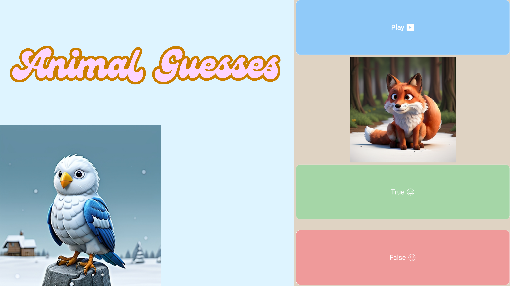

  

# 🐾 Animal Guesses Web

**🎧 Listen. 🐶 Recognize. 🧠 Guess.**  
Welcome to **Animal Guesses**, a playful animal sound quiz filled with chirping birds, roaring lions, and mooing cows!  
Built with 💙 Flutter and deployed to the web.

---

## 🌍 Live Version

🚀 **Click and play directly in your browser:**

👉 [https://animalguesses.raimonvibe.com/](https://animalguesses.raimonvibe.com/)

---

## 🎮 What Is This?

**Animal Guesses** is an interactive quiz where users try to guess the correct animal based on a sound 🎵 and an image 📸.  
Perfect for kids, animal lovers, or anyone looking for a fun moment!

---

## 📦 What's in This Repo?

> This repository only contains the **web build** of the Flutter app.  
> The source code is located in the original Flutter project on your machine.

📁 Contents:

- `index.html` – App entry point  
- `main.dart.js` – Compiled Dart app  
- `flutter.js` – Flutter runtime for web  
- `/assets/` – Sounds and images of animals  
- `Animal-Guesses.png` – The main promotional image  
- `.nojekyll` – Required for GitHub Pages

---

## 🐯 Features

- 🎵 Play real animal sounds
- 🐻 Guess what animal you're hearing
- 🌈 Beautiful visual cues
- ⭐ Feedback on right or wrong answers
- 🔁 Restart when you've guessed them all
- ⚙️ Built with Flutter Web

---

## 🐘 Emoji Time (Animals You Might Encounter)

| Animal | Emoji |
|--------|-------|
| Dog    | 🐶    |
| Cat    | 🐱    |
| Cow    | 🐮    |
| Sheep  | 🐑    |
| Elephant | 🐘 |
| Lion   | 🦁    |
| Owl    | 🦉    |
| Monkey | 🐒    |
| Dolphin| 🐬    |
| Parrot | 🦜    |

---

## 💡 Built By

👤 **Raimon**  
📍 [GitHub](https://github.com/raimonvibe)  
📅 Built with love and a cup of coffee ☕

---

## 🪪 License

MIT © Raimon 5  
Free to use, modify and share – just make something beautiful with it 🌟
